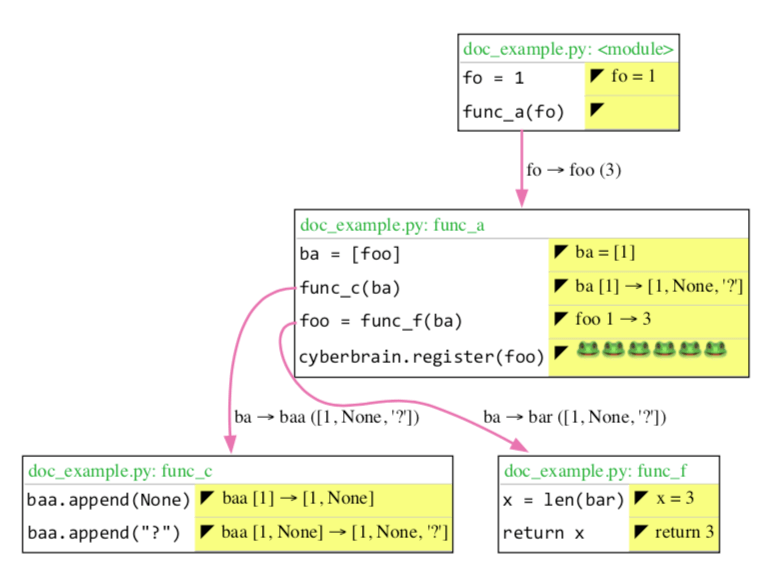

# Cyberbrain: helps you remember everything

 [](https://dev.azure.com/laike9m/laike9m/_build/latest?definitionId=1&branchName=master) 


NOTE: This is a WIP, **DON'T** use it in production.

📢 I'm looking for collaborators who's interested in **visualization**. Please don't hesitate to contact me.

I gave a talk at PyCon China 2019 about Cyberbrain, slide can be found [here](https://yanshuo.io/assets/player/?deck=5d6c9136d37616007449891e#/).

## How to use
1. Install [Graphviz](https://www.graphviz.org/download/)
2. `pip install cyberbrain`
3. In your program, first call `cyberbrain.init()`, then call `cyberbrain.register(target_variable)`.

Here's an example.

```python
def func_f(bar):
    x = len(bar)
    return x

def func_c(baa):
    baa.append(None)
    baa.append('?')

def func_a(foo):
    for i in range(2): pass
    ba = [foo]
    func_c(ba)
    foo = func_f(ba)  # foo is our target
    cyberbrain.register(foo)

import cyberbrain
cyberbrain.init()
fo = 1
func_a(fo)
```

Run it, a pdf like this will be generated and automatically opened.



# Developement
First install [`Poetry`](https://github.com/sdispater/poetry), then run `poetry install`.
